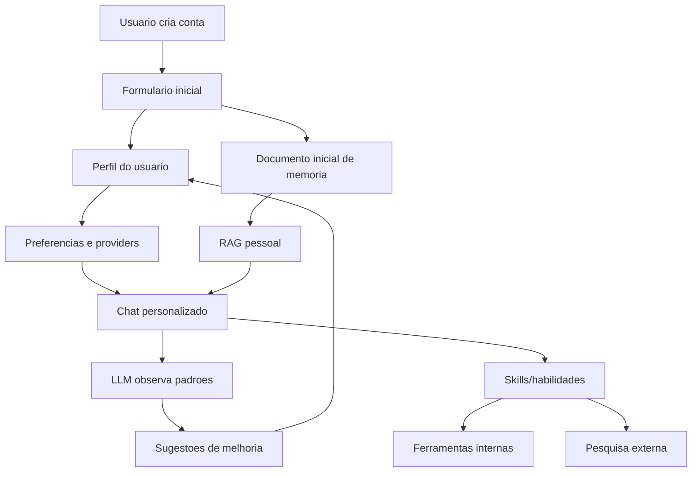

# Plano ampliado: chatbot multiusuario, RAG pessoal, preferencias e skills

Este documento expande as ideias anotadas nas conversas e organiza um caminho de implementacao para transformar o chatbot atual em um sistema multiusuario com login, memoria pessoal, RAG isolado, providers por usuario e habilidades acionaveis.

## Objetivo

Criar um chatbot onde cada usuario tenha:

- Login e senha proprios.
- Conversas privadas e isoladas.
- RAG separado por usuario, com arquivos e colecoes proprias.
- Perfil inicial preenchido no cadastro para personalizar o chat desde a primeira mensagem.
- Preferencias de uso, providers, modelos, idioma, tom e objetivos.
- Aprendizado assistido por LLM para sugerir melhorias de perfil e memoria.
- Skills/habilidades ativaveis para executar fluxos internos, pesquisas, ferramentas e rotinas.

## Principios do sistema

- Tudo que for do usuario precisa ter `user_id`.
- Nenhuma chave de API, token OAuth ou refresh token deve voltar para o frontend sem mascara.
- RAG nunca deve misturar documentos de usuarios diferentes.
- O onboarding inicial vira conhecimento estruturado e tambem pode alimentar o RAG.
- O sistema pode sugerir ajustes de preferencias, mas mudancas importantes devem pedir confirmacao do usuario.
- Skills precisam ter permissao, escopo e auditoria. Uma skill nao deve virar acesso livre ao sistema operacional.

## Arquitetura proposta



## Cadastro e login

### Cadastro

Campos minimos:

- `email`
- `username`
- `password`
- `display_name`
- `language`
- `timezone`

Campos opcionais no primeiro formulario:

- Como quer ser chamado.
- Profissao, papel ou area de estudo.
- Objetivos principais com o chatbot.
- Estilo de resposta preferido: direto, detalhado, professor, parceiro de codigo, criativo.
- Nivel tecnico.
- Assuntos frequentes.
- Coisas que o chatbot deve evitar.
- Providers ou modelos favoritos.
- Preferencia de privacidade/memoria.

### Login

Implementacao recomendada:

- Hash de senha com Argon2 ou bcrypt.
- Sessao via JWT curto + refresh token, ou cookie httpOnly se a UI e API estiverem no mesmo dominio.
- Dependencia de autenticacao para todas as rotas sensiveis.
- WebSocket/SSE autenticado tambem, nao so REST.

### Criacao automatica de estrutura por usuario

Ao criar usuario:

- Criar registro em `users`.
- Criar `user_profiles`.
- Criar preferencias padrao em `user_preferences`.
- Criar pasta local: `data/users/{user_id}/`.
- Criar pasta de documentos: `data/users/{user_id}/documents/`.
- Criar pasta/namespace RAG: `data/users/{user_id}/rag/`.
- Criar colecao vetorial: `rag_user_{user_id}`.
- Gerar um documento inicial de memoria a partir do formulario.
- Indexar esse documento no RAG do usuario.

## Modelo de dados sugerido

### `users`

- `id`
- `email`
- `username`
- `password_hash`
- `is_active`
- `is_admin`
- `created_at`
- `updated_at`

### `user_profiles`

- `id`
- `user_id`
- `display_name`
- `language`
- `timezone`
- `role`
- `technical_level`
- `preferred_tone`
- `goals_json`
- `avoid_json`
- `memory_policy`
- `created_at`
- `updated_at`

### `user_preferences`

- `id`
- `user_id`
- `key`
- `value_json`
- `source`
- `confidence`
- `created_at`
- `updated_at`

Exemplos:

- `default_provider`
- `default_model`
- `answer_style`
- `code_style`
- `search_preference`
- `rag_aggressiveness`

### `user_provider_configs`

- `id`
- `user_id`
- `provider_id`
- `display_name`
- `base_url`
- `model`
- `api_key_encrypted`
- `oauth_tokens_encrypted`
- `is_enabled`
- `is_default`
- `created_at`
- `updated_at`

Regra importante: API keys e tokens devem ser retornados apenas mascarados, por exemplo `sk-...abcd`.

### `conversations`

Adicionar ou garantir:

- `user_id`
- `title`
- `language`
- `provider_id`
- `model`
- `created_at`
- `updated_at`

### `messages`

Adicionar ou garantir:

- `user_id`
- `conversation_id`
- `role`
- `content`
- `parts_json`
- `metadata_json`
- `created_at`

### `documents`

- `id`
- `user_id`
- `filename`
- `mime_type`
- `storage_path`
- `source`
- `status`
- `created_at`

### `rag_chunks`

- `id`
- `user_id`
- `document_id`
- `collection_name`
- `chunk_text`
- `embedding_id`
- `metadata_json`
- `created_at`

### `skills`

- `id`
- `name`
- `description`
- `kind`
- `definition_json`
- `requires_network`
- `requires_shell`
- `risk_level`
- `created_at`
- `updated_at`

### `user_skills`

- `id`
- `user_id`
- `skill_id`
- `is_enabled`
- `config_json`
- `created_at`
- `updated_at`

### `preference_suggestions`

- `id`
- `user_id`
- `suggestion_type`
- `current_value_json`
- `suggested_value_json`
- `reason`
- `confidence`
- `status`
- `created_at`
- `resolved_at`

Status:

- `pending`
- `accepted`
- `rejected`
- `expired`

## RAG por usuario

### Isolamento

Cada usuario deve ter:

- Colecao vetorial propria.
- Pasta propria para uploads.
- Metadados com `user_id`.
- Busca sempre filtrada por `user_id`.

Nunca usar uma colecao global sem filtro de usuario.

### Documento inicial de memoria

O formulario inicial deve gerar um texto estruturado, por exemplo:

```markdown
# Perfil inicial do usuario

Nome preferido: ...
Idioma: ...
Objetivos: ...
Estilo de resposta: ...
Nivel tecnico: ...
Assuntos frequentes: ...
Evitar: ...
Providers preferidos: ...
```

Esse documento entra no RAG como `source=onboarding`.

### Uploads

Arquivos suportados no caminho ideal:

- `.txt`
- `.md`
- `.json`
- `.csv`
- `.pdf`
- `.docx`

PDF e DOCX precisam de parser real. Nao podem ser tratados como UTF-8 puro.

### Consulta

Ao responder no chat:

1. Identificar `user_id` autenticado.
2. Carregar perfil e preferencias.
3. Buscar no RAG pessoal.
4. Montar contexto com limites de tokens.
5. Chamar provider/modelo efetivo daquele usuario.
6. Registrar fontes usadas na mensagem.

## Personalizacao por LLM

O LLM pode ajudar a melhorar o perfil do usuario, mas com cuidado.

### O que o LLM pode observar

- Correcoes repetidas do usuario.
- Preferencias declaradas: "responda mais curto", "quero codigo completo".
- Padroes de uso: sempre pede Python, sempre pede GitHub, sempre pede resumo.
- Duvidas frequentes que poderiam virar memoria.
- Informacoes estaveis de projeto.

### O que o LLM deve fazer

- Criar sugestoes em `preference_suggestions`.
- Perguntar ao usuario em momentos oportunos.
- Gerar resumo de memoria revisavel.
- Melhorar tags dos documentos no RAG.
- Sugerir skills uteis.

### O que o LLM nao deve fazer sozinho

- Alterar senha, providers ou chaves.
- Enviar dados para outro usuario.
- Salvar informacao sensivel sem confirmacao.
- Executar shell livre.
- Ativar skills de alto risco sem permissao.

### Exemplos de perguntas inteligentes

- "Percebi que voce prefere respostas com passos praticos. Quer que eu salve isso como preferencia?"
- "Esse projeto parece ser seu foco principal agora. Quer que eu crie uma memoria fixa sobre ele?"
- "Voce costuma pedir pesquisa antes de decidir. Quer ativar uma skill de pesquisa + resposta?"
- "Quer que eu responda sempre em portugues, a menos que voce peca outro idioma?"

## Skills e habilidades

Skills sao capacidades nomeadas que o chatbot pode usar quando fizer sentido.

### Tipos de skill

- `knowledge`: instrucao sobre como fazer algo.
- `internal_tool`: chama recurso ja existente no backend.
- `external_search`: consulta API, buscador, scraper ou servico externo.
- `workflow`: combina varias etapas.
- `shell_guarded`: usa comandos locais com regras fortes.

### Exemplo: skill de pesquisa simples

Nome: `simple_google_search`

Ideia:

- Ensina o agente a fazer uma pesquisa simples.
- Pode usar uma API de busca configurada.
- Se permitido, pode usar `curl` em endpoint proprio.
- Retorna titulo, link, snippet e data quando disponivel.

Nao deve ser um `curl google.com` improvisado em producao. O ideal e ter um provider de busca configuravel, com limites, logs e tratamento de erro.

### Exemplo: skill pesquisa + pergunta

Nome: `search_and_answer`

Fluxo:

1. Recebe pergunta do usuario.
2. Gera termos de busca.
3. Chama recurso interno de pesquisa.
4. Opcionalmente usa Perplexity/scraper se configurado.
5. Resume achados.
6. Responde com fontes.
7. Salva aprendizado se o usuario autorizar.

### Skill registry

Cada skill deve declarar:

- Nome.
- Descricao.
- Quando usar.
- Entradas.
- Saidas.
- Permissoes.
- Risco.
- Provider necessario.
- Se usa rede.
- Se pode salvar memoria.
- Testes minimos.

### Permissoes por usuario

O usuario deve poder:

- Ativar/desativar skills.
- Configurar skill.
- Ver historico de execucao.
- Revogar permissao.

## Providers por usuario

Hoje o sistema mistura configuracoes globais e providers em pontos diferentes. O modelo novo deve separar:

- Providers globais do sistema.
- Providers configurados pelo usuario.
- Provider default do usuario.
- Provider efetivo de cada conversa.

### Regras

- `/health` deve mostrar provider efetivo sem vazar segredo.
- `/profiles` deve ler a mesma fonte de verdade do provider manager.
- `/providers/test` deve testar exatamente o provider selecionado.
- Rotas de gerenciamento precisam estar autenticadas.
- `include_keys=true` deve ser removido ou restrito a admin local com retorno mascarado.
- Tokens OAuth devem ficar criptografados e escopados por usuario.

## Seguranca prioritaria

Antes de liberar multiusuario real, corrigir:

- Rotas sem autenticacao.
- WebSocket sem autenticacao.
- Vazamento de API keys em `/providers/manage`.
- Vazamento de tokens em pool de contas.
- Conversas sem `user_id`.
- RAG global.
- Upload global.
- CORS aberto.
- Rate limit incompleto.

## Migracao do estado atual

Como o projeto nasceu single-user, a migracao pode criar um usuario local padrao.

Passos:

1. Criar usuario `local-admin`.
2. Atribuir conversas existentes a esse usuario.
3. Atribuir documentos existentes a esse usuario.
4. Mover arquivos para `data/users/{user_id}/`.
5. Criar colecao RAG pessoal.
6. Reindexar documentos se necessario.
7. Marcar providers antigos como globais ou como pertencentes ao `local-admin`.

## Ordem de implementacao recomendada

### Fase 0: documentacao e contrato

- Consolidar este plano.
- Atualizar resumo do projeto.
- Listar endpoints atuais que precisam de auth.
- Definir variaveis `.env`.

### Fase 1: corrigir riscos atuais

- Alinhar IDs de providers entre `.env.example`, config e provider manager.
- Remover fallback antigo `zen-free`.
- Mascarar/remover retorno de chaves.
- Mascarar/remover retorno de access/refresh token do pool Codex.
- Corrigir `/providers/test` para testar provider selecionado.
- Corrigir `/profiles` e `/health` para usarem a mesma fonte de provider efetivo.
- Corrigir historico para buscar as mensagens mais recentes antes de montar contexto.

### Fase 2: base multiusuario

- Criar modelo `User`.
- Criar hash de senha.
- Criar endpoints de cadastro/login/me/logout.
- Criar dependencia `get_current_user`.
- Proteger REST.
- Proteger WebSocket/SSE.

### Fase 3: dados por usuario

- Adicionar `user_id` em conversas, mensagens, documentos e provider configs.
- Filtrar todos os repositorios por `user_id`.
- Criar migracao para usuario padrao.
- Garantir que uma sessao nao consiga ler dados de outro usuario.

### Fase 4: RAG pessoal e onboarding

- Criar formulario inicial no frontend.
- Gerar documento inicial de memoria.
- Criar storage por usuario.
- Criar colecao RAG por usuario.
- Corrigir parser de PDF/DOCX.
- Indexar uploads por usuario.

### Fase 5: preferencias assistidas por LLM

- Criar tabela de sugestoes.
- Criar job ou rotina leve que analisa conversas recentes.
- Mostrar sugestoes no chat ou painel.
- Permitir aceitar/rejeitar.
- Atualizar perfil somente com confirmacao.

### Fase 6: skills

- Criar registry de skills.
- Criar `user_skills`.
- Implementar primeira skill `search_and_answer`.
- Implementar permissao e logs.
- Integrar roteamento de skill no chat.

### Fase 7: acabamento

- Painel de perfil.
- Painel de providers.
- Painel de memoria/RAG.
- Painel de skills.
- Auditoria de execucoes.
- Testes e documentacao de deploy.

## Primeira entrega pratica sugerida

Para comecar sem quebrar tudo:

1. Corrigir vazamentos e inconsistencias de providers.
2. Criar modelos e endpoints de auth.
3. Colocar `user_id` em conversas.
4. Proteger chat e WebSocket.
5. Criar onboarding simples.
6. Criar RAG por usuario.

Essa ordem cria a fundacao segura antes de adicionar inteligencia extra.

## Checklist de pronto para multiusuario real

- Login funcionando.
- Senha com hash.
- Nenhuma rota sensivel sem auth.
- WebSocket/SSE autenticado.
- Conversas filtradas por usuario.
- Documentos filtrados por usuario.
- RAG filtrado por usuario.
- Providers filtrados por usuario.
- Chaves mascaradas.
- Tokens OAuth mascarados/criptografados.
- Testes cobrindo tentativa de acessar dado de outro usuario.
- Onboarding criando memoria inicial.
- Preferencias podem ser vistas e editadas.
- Sugestoes de LLM exigem confirmacao.
- Skills tem permissao e log.

