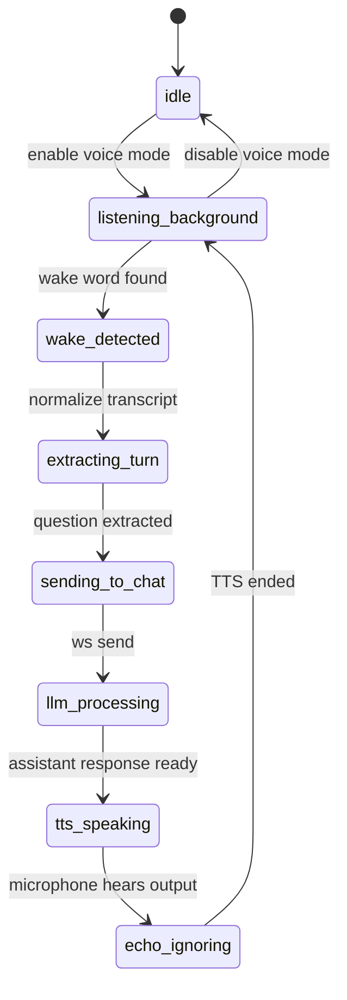

# VoiceWakeMode Future Plan

> **For agentic workers:** REQUIRED SUB-SKILL: Use `superpowers:subagent-driven-development` or `superpowers:executing-plans` if this plan is implemented task-by-task later. Steps use checkbox syntax for tracking.

**Goal:** add a future continuous voice layer that listens for a wake word, extracts a clean user question, sends it through the existing chat flow, and keeps background transcription collapsed instead of polluting the LLM context.

**Architecture:** `VoiceWakeMode` must be a separate frontend-first layer before the normal chat pipeline. The existing WebSocket chat engine remains the main brain; voice only converts speech into a clean chat message plus optional metadata.

**Tech Stack:** React + TypeScript frontend, browser SpeechRecognition/Web Speech API for the first version, existing WebSocket `/ws` chat flow, optional backend persistence with SQLite metadata later.

---

## Product Summary

This feature is a future "Jarvis listening mode" for the chatbot.

The current chat already has the right foundation:

- The frontend sends chat messages through WebSocket.
- The backend streams `start`, `status`, `reasoning`, `token`, and `done`.
- The frontend already renders assistant bubbles while tokens arrive.
- The system already supports user accounts, RAG, skills, preferences, documents, and workspace separation.

The voice feature should not rewrite that system.

Correct direction:

```txt
Microphone / STT
  -> VoiceBuffer
  -> WakeWordDetector
  -> TurnExtractor
  -> existing chat WebSocket send
  -> collapsed transcript shown in UI
```

Wrong direction:

```txt
Microphone / STT
  -> raw infinite transcript
  -> ChatEngine
  -> LLM receives everything
```

The LLM should receive the active question, not every noise captured by the microphone.

---

## Core Rules

- Keep voice as a separate layer before chat.
- Do not send raw continuous transcription to the LLM.
- Do not mix model reasoning with microphone transcription.
- Keep background transcript collapsed in the UI.
- Ignore microphone input while TTS is speaking.
- Detect bot echo by comparing STT text with the last assistant spoken text.
- Preserve normal text chat behavior when voice mode is disabled.
- Start frontend-only first; backend persistence is phase 2.
- Keep each implementation phase small to avoid long blocking work.

---

## Target User Experience

Initial button states:

```txt
[Ativar escuta continua]
[Escutando...]
[Jarvis detectado]
[Respondendo...]
[Falando...]
```

Example captured audio:

```txt
background: "preciso ver aquele cabo"
background: "barulho no quarto"
active: "que horas sao Jarvis"
```

Visible chat result:

```txt
Voce: que horas sao?

> Transcricao de fundo
> "preciso ver aquele cabo"
> "barulho no quarto"

Assistente: Sao 15:42.
```

The background transcript is visible for transparency, but it is collapsed and treated as optional context.

---

## Proposed Frontend Files

Create:

```txt
frontend/src/voice/voiceTypes.ts
frontend/src/voice/wakeWord.ts
frontend/src/voice/transcriptBuffer.ts
frontend/src/voice/turnExtractor.ts
frontend/src/voice/echoFilter.ts
frontend/src/voice/useContinuousVoice.ts
frontend/src/components/CollapsedTranscriptBlock.tsx
frontend/src/components/VoiceWakePanel.tsx
```

Modify:

```txt
frontend/src/App.tsx
frontend/src/types.ts
frontend/src/api.ts
```

Optional later:

```txt
src/db/models.py
src/db/repos.py
src/api/routes.py
```

---

## Data Types

Frontend type target:

```ts
export type TranscriptKind =
  | "background"
  | "active_turn"
  | "assistant_echo"
  | "ignored";

export type WakeDirection =
  | "wake_before_question"
  | "question_before_wake"
  | "wake_middle";

export type TranscriptBlock = {
  id: string;
  text: string;
  kind: TranscriptKind;
  startedAt: number;
  endedAt: number;
  ignoredByLLM: boolean;
};

export type VoiceMeta = {
  source: "voice";
  wakeWord: string;
  direction: WakeDirection;
  collapsedTranscript: TranscriptBlock[];
  transcriptWindowSeconds: number;
};
```

Chat message extension:

```ts
export type ChatMessage = {
  id: string;
  role: "user" | "assistant" | "system";
  content: string;
  reasoning?: string;
  voiceMeta?: VoiceMeta;
};
```

Backend payload target for phase 2:

```json
{
  "type": "chat",
  "message": "que horas sao?",
  "session_id": "default",
  "use_rag": false,
  "use_thinking": true,
  "voice_meta": {
    "source": "voice",
    "wake_word": "jarvis",
    "direction": "question_before_wake",
    "transcript_window_seconds": 30,
    "collapsed_transcript": []
  }
}
```

---

## Wake Word Rules

Supported wake forms:

```txt
Jarvis, que horas sao?
que horas sao, Jarvis?
me diz Jarvis que horas sao?
ei Jarvis abre meus documentos
assistente resume isso
```

Extraction rules:

- If text exists after the wake word, prefer the text after it.
- If there is no useful text after the wake word, use the text before it.
- If text exists on both sides, prefer the more question-like or more recent side.
- Normalize commas, repeated spaces, and casing before extraction.
- Never send the wake word itself as part of the final question unless the user is asking about the wake word.

Examples:

```txt
"Jarvis que horas sao"
-> question: "que horas sao"
-> direction: "wake_before_question"

"que horas sao Jarvis"
-> question: "que horas sao"
-> direction: "question_before_wake"

"me diz Jarvis que horas sao"
-> question: "que horas sao"
-> direction: "wake_middle"
```

---

## Echo Guard Rules

During TTS:

```txt
isSpeaking = true
```

Any transcript captured during this window becomes:

```txt
kind = "assistant_echo"
ignoredByLLM = true
collapsed = true
```

After TTS ends:

```txt
isSpeaking = false
```

Extra protection:

- Store `lastAssistantSpokenText`.
- Compare new transcript text with that spoken text.
- If the transcript is very similar to the assistant output, mark it as `assistant_echo`.
- Do not trigger wake word handling from assistant echo.

This avoids the assistant hearing itself and starting a loop.

---

## State Machine



---

## LLM Context Policy

The LLM receives:

```json
{
  "message": "que horas sao?",
  "voice_context": {
    "recent_background_summary": "O usuario mencionou um cabo antes da pergunta. Pode ser irrelevante.",
    "wake_word": "jarvis",
    "transcript_window_seconds": 30
  },
  "rules": [
    "Responda apenas a pergunta ativa.",
    "Use o contexto de fundo somente se for claramente util.",
    "Nao mencione microfone, transcricao ou palavra de ativacao."
  ]
}
```

The UI may store more metadata than the LLM receives. That is intentional.

---

## Phase 1: Frontend-Only Functional Prototype

Goal: prove the experience without database migrations or backend changes.

Files:

- Create: `frontend/src/voice/voiceTypes.ts`
- Create: `frontend/src/voice/wakeWord.ts`
- Create: `frontend/src/voice/transcriptBuffer.ts`
- Create: `frontend/src/voice/turnExtractor.ts`
- Create: `frontend/src/voice/echoFilter.ts`
- Create: `frontend/src/voice/useContinuousVoice.ts`
- Create: `frontend/src/components/VoiceWakePanel.tsx`
- Create: `frontend/src/components/CollapsedTranscriptBlock.tsx`
- Modify: `frontend/src/App.tsx`
- Modify: `frontend/src/types.ts`

Steps:

- [ ] Add the `VoiceMeta`, `TranscriptBlock`, and state machine types.
- [ ] Implement wake word detection for `jarvis`, `ei jarvis`, and `assistente`.
- [ ] Implement extraction for wake-before-question, question-before-wake, and wake-middle.
- [ ] Implement a rolling transcript buffer with a default 30 second window.
- [ ] Add echo filtering using `isSpeaking` and `lastAssistantSpokenText`.
- [ ] Add `VoiceWakePanel` with enable/disable and current state.
- [ ] Add `CollapsedTranscriptBlock` under user voice messages.
- [ ] Reuse the existing chat send function after extracting the clean question.
- [ ] Keep the feature disabled by default.
- [ ] Add manual verification notes in the PR or commit message.

Manual validation:

```txt
1. Enable voice mode.
2. Say "Jarvis que horas sao".
3. Confirm the chat sends only "que horas sao".
4. Say "que horas sao Jarvis".
5. Confirm the chat sends only "que horas sao".
6. Make the assistant speak through TTS.
7. Confirm its own spoken response does not trigger another request.
8. Disable voice mode.
9. Confirm normal text chat still works.
```

Anti-hang rule:

- Do not start a long backend server just to validate this phase.
- Use browser manual checks first.
- If automated checks are allowed later, keep them focused on pure frontend helper functions.

---

## Phase 2: Backend Metadata Persistence

Goal: preserve voice metadata when conversation history reloads.

Files:

- Modify: `src/db/models.py`
- Modify: `src/db/repos.py`
- Modify: `src/api/routes.py`
- Modify: `frontend/src/api.ts`
- Modify: `frontend/src/types.ts`

Database direction:

```txt
messages.source
messages.metadata_json
```

Recommended values:

```txt
source = "text" | "voice" | "system"
metadata_json = serialized VoiceMeta
```

Steps:

- [ ] Add nullable `source` to messages with default `"text"`.
- [ ] Add nullable `metadata_json` to messages.
- [ ] Accept optional `voice_meta` in WebSocket chat payload.
- [ ] Save `voice_meta` only for the authenticated user's message.
- [ ] Return metadata when loading conversation history.
- [ ] Render `CollapsedTranscriptBlock` after reload.
- [ ] Keep old messages compatible when metadata is missing.

Validation when tests are allowed:

```powershell
python -m unittest tests.test_voice_metadata
```

Anti-hang rule:

- Test only repository serialization and route payload handling.
- Do not run full slow suites for this phase unless the user asks.

---

## Phase 3: User Settings

Goal: make voice behavior personal per user.

Files:

- Modify: `src/db/models.py`
- Modify: `src/db/repos.py`
- Modify: `src/api/routes.py`
- Modify: `frontend/src/components/PreferencesPanel.tsx`
- Modify: `frontend/src/components/VoiceWakePanel.tsx`

Settings:

```json
{
  "voice_enabled_by_default": false,
  "wake_words": ["jarvis", "ei jarvis", "assistente"],
  "transcript_window_seconds": 30,
  "auto_tts": false,
  "show_collapsed_transcript": true,
  "send_background_summary_to_llm": false
}
```

Steps:

- [ ] Store voice settings per authenticated user.
- [ ] Add UI controls for wake words and transcript window.
- [ ] Validate that wake words are non-empty and reasonable length.
- [ ] Keep voice disabled by default for privacy.
- [ ] Add a clear warning that the browser microphone permission is required.
- [ ] Never enable the microphone automatically after login without explicit user action.

---

## Phase 4: Smarter Context Summaries

Goal: summarize recent background transcript without flooding the main model.

Files:

- Create: `src/core/voice_context.py`
- Modify: `src/api/routes.py`
- Modify: `frontend/src/voice/transcriptBuffer.ts`

Policy:

- Raw background transcript stays in UI metadata.
- The LLM receives only the active question plus a tiny optional summary.
- Background summary must be ignored unless clearly useful.

Steps:

- [ ] Create a small backend helper that accepts collapsed transcript blocks.
- [ ] Generate a short summary with a cheap/local model or deterministic fallback.
- [ ] Attach summary under `voice_context.recent_background_summary`.
- [ ] Add a user setting to disable background summaries completely.
- [ ] Add maximum size limits for transcript metadata.

Hard limits:

```txt
max collapsed blocks: 20
max text per block: 500 chars
max total metadata JSON: 32 KB
max LLM background summary: 300 chars
```

---

## Phase 5: RAG and Skills Voice Commands

Goal: let voice mode trigger existing project capabilities without bypassing permissions.

Voice commands:

```txt
Jarvis lembra disso
Jarvis isso e importante
Jarvis salva isso no workspace
Jarvis pesquisa isso
Jarvis abre meus documentos
Jarvis resume esse arquivo
Jarvis para
Jarvis ignora
Jarvis repete
```

Rules:

- Voice commands must route through the same authenticated APIs as buttons/text commands.
- Voice cannot bypass workspace safe paths.
- Voice cannot access another user's RAG.
- Voice cannot run a skill without that user's permission.
- Destructive voice commands require confirmation.

Steps:

- [ ] Add a command classifier after turn extraction.
- [ ] Map safe commands to existing chat, RAG, workspace, and skills flows.
- [ ] Add confirmation prompts for delete, overwrite, external requests, or shell-like skills.
- [ ] Log voice-triggered skills in the existing skills audit trail.
- [ ] Show command interpretation in the UI before execution when risk is medium/high.

---

## Security And Privacy Checklist

- [ ] Voice mode starts disabled.
- [ ] User must explicitly activate microphone permission.
- [ ] No raw infinite transcript is sent to the backend by default.
- [ ] No background transcript is sent to the LLM unless configured.
- [ ] Echo is marked as `assistant_echo` and ignored.
- [ ] Metadata is tied to the authenticated user.
- [ ] Backend rejects oversized `voice_meta`.
- [ ] Backend rejects invalid JSON metadata.
- [ ] RAG voice commands use the user's personal collection only.
- [ ] Workspace voice commands use `safe_user_path`.
- [ ] Skills voice commands obey the same permissions as normal skills.

---

## Integration With Existing Architecture

Expected boundaries:

```txt
VoiceWakeMode
  owns: microphone, transcript buffer, wake word, echo guard

Chat UI
  owns: message rendering, collapsed transcript block, send action

WebSocket API
  owns: authenticated chat streaming

RAG
  owns: user documents and retrieval

Skills
  owns: permitted tool execution and audit
```

Do not move wake-word logic into RAG.

Do not move microphone state into provider logic.

Do not make `ChatEngine` responsible for raw transcription.

---

## Rollout Order

Recommended order:

1. Phase 1 frontend-only prototype.
2. Small commit.
3. Phase 2 metadata persistence.
4. Small commit.
5. Phase 3 user settings.
6. Small commit.
7. Phase 4 background summaries.
8. Small commit.
9. Phase 5 RAG and skills voice commands.
10. Final audit.

Do not combine phases unless the code is already tiny and obvious.

---

## Definition Of Ready

This plan is ready to implement when:

- The current chat WebSocket flow is stable.
- The frontend has a clear send-message function that voice can reuse.
- The team agrees to start frontend-only.
- Browser support expectations are accepted.
- Privacy default is confirmed as voice disabled.

---

## Definition Of Done

The complete future feature is done only when:

- Voice mode can be enabled and disabled from the UI.
- Wake words trigger clean chat messages.
- `Jarvis pergunta`, `pergunta Jarvis`, and middle wake-word forms work.
- Background transcript appears collapsed, not as giant chat text.
- Assistant echo does not trigger recursive requests.
- Normal text chat still works unchanged.
- Voice metadata persists after reload.
- User wake-word settings persist per account.
- Optional background summaries are size-limited.
- RAG commands stay user-isolated.
- Skills commands obey permissions and audit logs.
- Destructive voice commands ask for confirmation.

---

## Important Non-Goals For The First Version

- No always-on backend audio streaming.
- No custom wake-word ML model.
- No diarization in phase 1.
- No native desktop microphone daemon.
- No automatic memory writes without confirmation.
- No direct shell command execution from voice.
- No replacing the current chat engine.

---

## Short Final Direction

Build `VoiceWakeMode` as a small layer in front of the current chat.

The voice layer listens, extracts, filters, and annotates.

The existing chat layer thinks, streams, answers, uses RAG, and uses skills.

That separation keeps the system useful without turning the LLM into a trash can for raw microphone noise.
